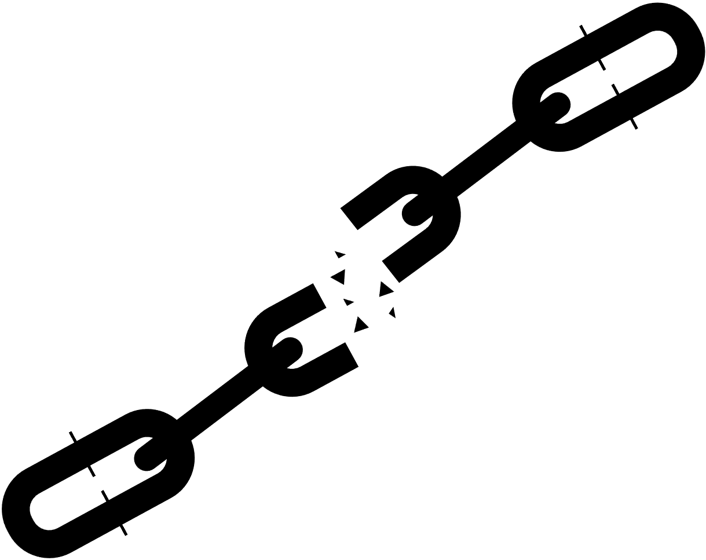

  

# Welcome to Eco-Flow

An initiative [funded](https://gtr.ukri.org/projects?ref=BB%2FX018768%2F1) by the BBSRC to development an agri-**eco**logy specific Next**flow** pipeline community and development program.

Our goal is to help researchers develop Nextflow code, teach basic/advanced topics around the UK and build functional pipelines to super charge UK research.
  

# Why

Agri-ecology research is critical for our understanding of the natural environment and the security of our food supply. 

However, tooling lags behind other research fields such as medicine; this bottleneck is holding back research and the speed at which this critical research gets published. In addition, research is often not reproducible, accessible or scalable.
  

# Our plan

 **1. BUILDING**

We will develop (within end-user communities) reproducible, easy-to-use, modular bioinformatics pipelines suitable for the most useful analyses required by ecologists in the application of omics data to address critical ecological questions. Specifically, we will use [Nextflow](https://www.nextflow.io/), a world leading pipeline development structure to create these pipelines.
  

 **2. TESTING**

Once we have developed our pipelines, we will ensure each module has unit testing (using [nf-test](https://shorturl.at/kpQ39)), as well as end to end pipeline tests with example data. Alongside our ambassadors and partner labs we can ensure pipelines are continuously tested and improved, so they remain active and relevant. 
  

 **3. TRAINING**

We address this mismatch by building resource bridges between ecologists – especially those working at the interface of insect ecology and agriculture - and bioinformatics; we will empower them with the autonomy to access and use the most appropriate cutting-edge analyses. Let’s remove the black box of bioinformatics!
 

 

**4. COMMUNITY**

Finally, while fulfilling the previous steps, we will build a community of pipeline developers in the UK. Pipeline development should be collaborative, interactive and accessible, so we will be hosting additional networking and hackathon events to build a community of developers that will compliment code devlopment.

  

# Contents

1. [Who are we ?](about.md)
2. [What services can we provide ?](services.md)
3. [Examples of current pipelines](pipelines.md)
4. [Who are our current research partners ?](partners.md)
5. [Citations](citations.md)

  

# Useful links

[Github](https://github.com/Eco-Flow/)
[Webpage Github](https://github.com/Eco-Flow/Eco-Flow.github.io)
[Nexflow](https://www.nextflow.io/)

[Home Page](home.md)
