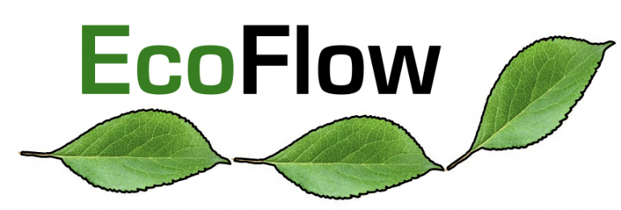

Welcome to the EcoFlow

An organisation funded by the BBSRC to promote the development of Nextflow in argi-ecology and environmental research.

Our goal is to help researchers develop Nextflow code, teach basic and advanced topics around the UK and build functional pipelines to super charge UK research.

# Contents

1. [Who are we ?](about.md)
2. What services can we provide ?
3. Examples of current pipelines
4. Who are our current research partners ?
5. Citations
