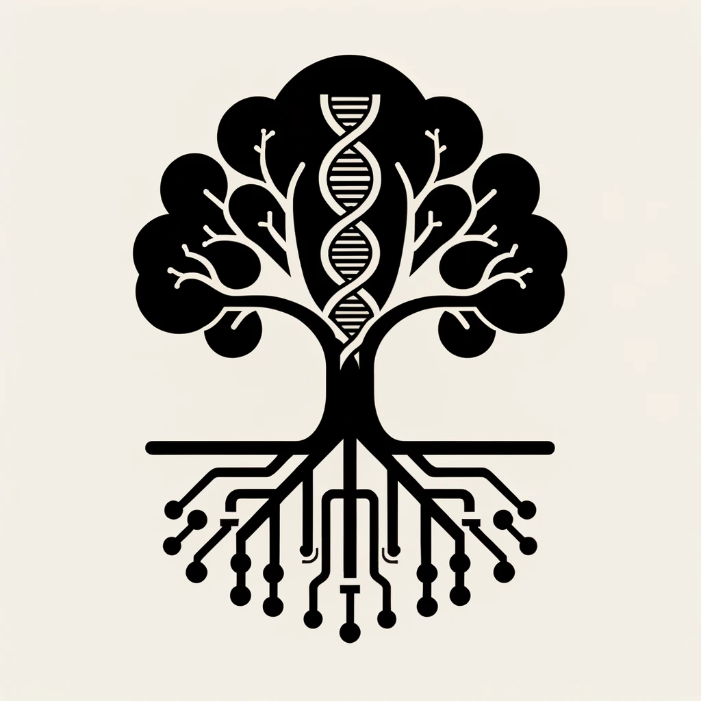

<picture>
  <source media="(prefers-color-scheme: dark)" srcset="./img/ecoflow-white.png">
  
</picture>

**A community of computational agri-ecologists building reproducible Nextflow pipelines for ecology.**

🌐 **[eco-flow.github.io](https://eco-flow.github.io)** &nbsp;·&nbsp;
[Pipelines](https://eco-flow.github.io/pipelines/) ·
[Training](https://eco-flow.github.io/training/) ·
[Blog](https://eco-flow.github.io/blog/) ·
[About](https://eco-flow.github.io/about/)

---

This repository is the source code for the **[Eco-Flow website](https://eco-flow.github.io)** — a [Jekyll](https://jekyllrb.com/) site hosted on GitHub Pages.

> **🛠 Maintaining the site?** See **[MAINTAINING.md](MAINTAINING.md)** for how to add blog posts, events and pipelines, run the site locally, and publish changes. For the file/folder map, see [website-structure.md](website-structure.md).

## About Eco-Flow

Eco-Flow is an initiative [funded by the BBSRC](https://gtr.ukri.org/projects?ref=BB%2FX018768%2F1) to build an agri-**eco**logy–specific Next**flow** pipeline community and development programme.

Agri-ecology research is critical to understanding the natural environment and securing our food supply, yet its tooling lags behind fields like medicine. We help researchers build, test and run reproducible pipelines with [Nextflow](https://www.nextflow.io/) and the [nf-core](https://nf-co.re/) framework — keeping research aligned with the **FAIR** (Findable, Accessible, Interoperable, Reusable) data principles.

## What we do

- **🔧 Building** — reproducible, modular, easy-to-use pipelines for the analyses ecologists actually need.
- **✅ Testing** — unit tests (nf-test) and end-to-end pipeline tests, maintained with our ambassadors and partner labs.
- **🎓 Training** — hands-on Nextflow/nf-core training to remove the "black box" of bioinformatics ([our course](https://eco-flow.github.io/training/)).
- **🤝 Community** — networking events and hackathons to grow a UK community of pipeline developers.

## Get involved

We're accepting expressions of interest. If you'd like us to build a pipeline — or help you build one — [**fill in this form**](https://forms.gle/zq7iSSRCY5iHM9f89) and we'll get back to you, or just [email us](mailto:ecoflow.ucl@gmail.com).

## Funding & partners

Funded by the **BBSRC** (Bioinformatics and Biological Resources Fund), hosted at **UCL**, and supported by **[Seqera Labs](https://seqera.io/)**. We build to the standards of **[nf-core](https://nf-co.re/)**.
