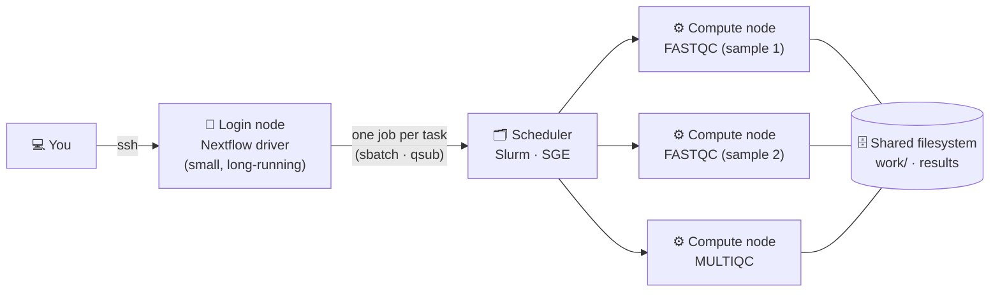

🚀 **Start now:** [](https://codespaces.new/Eco-Flow/training) — *first launch takes a couple of minutes to build.*

---

⏱ **Estimated time:** ~30–40 minutes &nbsp;•&nbsp; 🟡 Practical · optional

> 🎯 **Who is this for?** Anyone who wants to run an nf-core pipeline on their institution's **High-Performance Computing (HPC) cluster**, where Nextflow is already available and your cluster already has a ready-made config on [nf-co.re/configs](https://nf-co.re/configs).
>
> - 🖥️ **No cluster?** You can still do most of this page in Codespaces, on a tiny practice Slurm "cluster" you start with one command.
> - 🛠️ **Need to *build* a config for a cluster that doesn't have one yet?** That's the separate ★ [Advanced: setting up Nextflow for your HPC](/training/hpc-config/) page.

Throughout this page, command blocks are marked:

- 🖥️ **Try it here in Codespaces**
- 🏢 **On your cluster**: for when you're logged in to a real HPC

### What you'll learn

- How Nextflow runs differently on a cluster (login node, scheduler, compute nodes)
- What to check before your first run, and where your files should be
- Two ways to get a pipeline: `nextflow run nf-core/…` vs `git clone`
- How a pipeline decides what resources each step asks for
- How to submit and watch jobs with a scheduler (Slurm, with SGE equivalents)
- How to smoke-test a run, then keep a long run alive after you log out
- Common issues list

---

## Step 0 — How Nextflow runs on a cluster

In Codespaces, everything runs on one machine. A cluster is **many machines sharing one filesystem**. You log in to a shared **login node**, and a **scheduler** hands out time on the **compute nodes** to everyone's jobs.

Nextflow can handle the scheduler for you, so you don't need to write submission scripts by hand. The `nextflow run` process you start (the **driver**) does no analysis itself: it sends every task to the scheduler as a **separate job**, then watches them. Remember the parallel tasks from [Part 2](/training/pipelines/)? On a cluster they really can run on different machines at the same time.



| Term | What it means |
| :--- | :--- |
| **Login node** | Where you land after `ssh`. Shared by everyone: fine for editing files and submitting jobs, **not** for running heavy tools. |
| **Compute node** | The machines that do the real work. You only get them by submitting jobs. |
| **Scheduler** | Decides which job runs where, and when. Common ones: **Slurm**, **SGE**, PBS, LSF. |
| **Job** | One piece of work sent to the scheduler, with a request for CPUs, memory and time. |
| **Queue / partition** | A named group of compute nodes with its own limits. SGE calls it a *queue*, Slurm a *partition*. |
| **Driver** | The `nextflow run` process itself. It submits and watches jobs, and must keep running until the pipeline finishes. |

> 💡 **The pipeline doesn't change.** Just like in [Part 2](/training/pipelines/), only the *configuration* changes: one line (`executor = 'slurm'`) makes Nextflow submit jobs with `sbatch` instead of running them itself. You'll see that line in Step 4.

---

## Step 1 — Before you start 🏢

Log in to your cluster and check the basics. Module names vary between clusters; your HPC team's documentation will list them.

```bash
ssh your_username@your.cluster.ac.uk   # log in to the login node
module avail nextflow                  # is Nextflow provided as a module?
module load nextflow                   # load it (or install it yourself: see below)
nextflow -version
java -version                          # Nextflow needs Java 17 or newer
singularity --version || apptainer --version
```

- **No Nextflow module?** You can usually install it in your home directory by following the [official install guide](https://docs.seqera.io/nextflow/install).
- **Singularity, not Docker.** Docker needs a background service running with root privileges, which shared clusters can't hand out, so you'll use `-profile singularity` (or `apptainer`) where Codespaces used `-profile docker`. Both run the same containers.

### Is there already a config for your cluster?

This is the single most useful thing to check. The nf-core community keeps ready-made configs for around 160 institutions at **[nf-co.re/configs](https://nf-co.re/configs)**, each one describing that cluster's scheduler, container engine and limits. The page lists them by name — `cambridge`, `crick`, `eddie`, `imperial`, `sanger`, `ucl_myriad` and many more.

<!-- TODO: add a screenshot of the nf-co.re/configs profile list here -->

If yours is listed, you add it to your run as a profile, and Nextflow knows how to talk to your cluster:

```bash
nextflow run nf-core/demo -r 1.2.0 -profile test,<your_cluster> --outdir demo_results
```

That's the `-profile ucl_myriad` you saw in [Part 5](/training/nanopore-metabarcoding/). **Open your cluster's page first** — most list setup steps, such as which Java module to load.

**Not listed?** In order:

1. **Ask around your institution.** Someone in a neighbouring group often has a working config already.
2. **Ask your HPC team.** They may not know Nextflow, but they can tell you the scheduler, queue names and limits, which is most of what a config needs.
3. **Ask the community.** The [nf-core Slack](https://nf-co.re/join/slack) is friendly, and you can open an issue on [nf-core/configs](https://github.com/nf-core/configs/issues) describing your cluster — people there build configs regularly.
4. **Ask us.** Email Eco-Flow at **ecoflow . ucl @ gmail . com** and we'll help you put one together, or talk to your HPC team with you.

Writing one yourself is covered in ★ [Advanced: setting up Nextflow for your HPC](/training/hpc-config/).

### Where your files should be

| What | Default | Where it should go | How |
| :--- | :--- | :--- | :--- |
| **Work directory**: every intermediate file, can be huge | `./work` | Wherever your cluster keeps large working data | `-w /path/with/space/work` |
| **Results** | `--outdir` | Storage you can keep, ideally backed up | `--outdir /path/to/results` |
| **Nextflow's own files**: downloaded pipelines, plugins | `~/.nextflow` | Home is usually fine (it's small) | nothing to do |

> ⚠️ **Ask where large data should live — don't assume.** Many clusters have a "scratch" area for this, but not all do, and the rules differ: some aren't backed up, and some delete files you haven't touched for a few weeks. Your HPC team (or your cluster's page on nf-co.re/configs) will tell you. Two things to remember once you know: copy results somewhere safe, and if `work/` is deleted, `-resume` has nothing left to resume from.

📋 The full list of questions worth asking your HPC team is in [Step 1 of the advanced page](/training/hpc-config/).

---

## Step 2 — Getting a pipeline, and a quick look inside 🖥️

There are two ways to get a pipeline onto a machine. Both work the same way in Codespaces and on a cluster, so try them here.

We'll use **[nf-core/demo](https://nf-co.re/demo)**: a tiny nf-core pipeline (FastQC → trimming with seqtk → MultiQC) that runs in a couple of minutes.

### Way A — let Nextflow fetch it

> ▶️ **Try it** (from the `eco-flow-training` folder)
>
> ```bash
> nextflow pull nf-core/demo -r 1.2.0
> nextflow list
> nextflow info nf-core/demo
> ```

<details markdown="1">
<summary>✅ Roughly what you'll see</summary>

```
Checking nf-core/demo:1.2.0 ...
 downloaded from https://github.com/nf-core/demo.git - revision: 32893afef8 [1.2.0]
```

`nextflow list` shows every pipeline Nextflow has downloaded for you (`nf-core/rnaseq` is there too if you did Part 3), and `nextflow info` shows where it keeps them:

```
 project name: nf-core/demo
 repository  : https://github.com/nf-core/demo
 local path  : /home/vscode/.nextflow/assets/.repos/nf-core/demo
 main script : main.nf
 revisions   :
   ...
```
</details>

This is what `nextflow run nf-core/demo` does automatically the first time: it downloads the pipeline from GitHub into `~/.nextflow/assets/`, and **`-r` picks the release**. To delete a downloaded pipeline, use `nextflow drop nf-core/demo`.

> 💡 **Compute nodes without internet?** Pull the pipeline on the login node first. For the containers too, nf-core's [`nf-core pipelines download`](https://nf-co.re/docs/nf-core-tools/pipelines/download) fetches the pipeline *and* all its Singularity images in one go.

### Way B — clone it yourself

> ▶️ **Try it**
>
> ```bash
> mkdir -p ~/nf_practical      # a folder of its own, so it's easy to find and remove later
> cd ~/nf_practical
> git clone https://github.com/nf-core/demo.git
> cd demo
> git checkout 1.2.0
> ls
> ```

<details markdown="1">
<summary>✅ Roughly what you'll see</summary>

```
CHANGELOG.md  CITATIONS.md  CODE_OF_CONDUCT.md  LICENSE  README.md  assets  conf  docs
main.nf  modules  modules.json  nextflow.config  nextflow_schema.json  nf-test.config
ro-crate-metadata.json  subworkflows  tests  tower.yml  workflows
```
</details>

You'd then run it by giving Nextflow the **folder** instead of a name, e.g. `nextflow run ~/nf_practical/demo -profile test,docker --outdir demo_results` (no need to run it now). This is how you ran the nanopore pipeline in [Part 5](/training/nanopore-metabarcoding/) (`nextflow run main.nf`).

| | **Way A:** `nextflow run nf-core/demo -r 1.2.0` | **Way B:** `git clone` + `nextflow run ~/nf_practical/demo` |
| :--- | :--- | :--- |
| **Best for** | Running a published pipeline as-is | Editing the code, pipelines not on nf-core, development branches |
| **Where it lives** | `~/.nextflow/assets/` (managed for you) | Wherever you cloned it |
| **Pin the version** | `-r 1.2.0` | `git checkout 1.2.0` (`-r` isn't used for a folder) |
| **Update** | `nextflow pull nf-core/demo -r <new version>` | `git pull` for the latest code, or `git checkout <new version>` for a specific release |

> ⚠️ **Always pin the version** (see [Part 3](/training/nfcore-rnaseq/)). Nextflow itself also changes over time, and a very old pipeline release may not run on the newest Nextflow. If an old release stops with `Config parsing failed`, try a newer release of the pipeline.

### A quick look inside: who decides the CPUs and memory?

On a cluster, every step asks the scheduler for CPUs, memory and time. Those numbers come from the pipeline itself: each step (a *process*) has a **label**, and the pipeline's `conf/base.config` turns labels into resources.

Both files are in the copy of nf-core/demo you just cloned, so run these from inside `~/nf_practical/demo`:

> ▶️ **Challenge — what does FastQC ask for?**
>
> ```bash
> grep -n "label" modules/nf-core/fastqc/main.nf
> grep -n -A4 "withLabel:process_low" conf/base.config
> ```
>
> 1. How many CPUs, how much memory and how much time does the FASTQC step ask for?
> 2. The numbers are multiplied by `task.attempt`, which is `1` on the first try and `2` on a retry. What does FASTQC ask for on its second try?

<details markdown="1">
<summary>✅ Answer</summary>

```
3:    label 'process_low'
```
```
    withLabel:process_low {
        cpus   = { 2     * task.attempt }
        memory = { 12.GB * task.attempt }
        time   = { 4.h   * task.attempt }
    }
```

1. **2 CPUs, 12 GB, 4 hours.**
2. **4 CPUs, 24 GB, 8 hours.** Near the top of `conf/base.config`, the `errorStrategy` line says to **retry** a task that failed with an exit code between 130 and 145. Those codes usually mean the scheduler killed the job for using too much memory or time. So nf-core pipelines automatically try once more with double the resources.
</details>

On a cluster, these numbers become the job's request: a job asking for 12 GB waits until a node with 12 GB free is available. You'll see the real request Nextflow sends in Step 4.

<details markdown="1">
<summary>🔍 Optional — a tour of the pipeline folder, and the config Nextflow actually uses</summary>

| Path | What's in it |
| :--- | :--- |
| `main.nf` | The entry point: what `nextflow run` starts |
| `workflows/` | The main workflow: which steps run, in what order |
| `subworkflows/`, `modules/` | The building blocks. `modules/nf-core/` are shared with other nf-core pipelines, `modules/local/` are specific to this one |
| `conf/base.config` | Resources for each label (what you just looked at) |
| `conf/test.config` | The `test` profile: tiny example input and small resource caps |
| `nextflow.config` | Default parameters, and the **profiles** (`docker`, `singularity`, `test`, institutional configs…) |
| `nextflow_schema.json` | Every `--parameter`, with its description and allowed values |

`nextflow config` prints the final configuration after all profiles and config files are merged. Compare these two:

```bash
nextflow config ~/demo -profile test,docker
nextflow config ~/demo -profile test,singularity
```

Look for the `docker {` and `singularity {` blocks: switching the profile just flips which container engine is `enabled`. The pipeline code is identical.
</details>

Before moving on, go back to the course folder:

```bash
cd /workspaces/training/eco-flow-training
```

Once you're finished with the clone you can remove it. **Check the path before you press enter** — `rm -rf` deletes without asking:

```bash
rm -rf ~/nf_practical      # the folder you created above, nothing else
```

---

## Step 3 — Practise on a mini-cluster in Codespaces 🖥️

No cluster? No problem. This script turns your Codespace into a **one-node Slurm cluster**:

```bash
bash hpc/start_slurm.sh
```

<details markdown="1">
<summary>✅ Expected output</summary>

The first time, it installs Slurm (about a minute). Then:

```
▶ Your practice Slurm cluster is ready 🎉
PARTITION  AVAIL  TIMELIMIT  NODES  STATE NODELIST
codespace*    up   infinite      1   idle codespaces-abc123
```

`sinfo` prints this table any time: one partition called `codespace`, with one node (your Codespace), currently `idle`.
</details>

> ⚠️ **It's a pretend cluster:** one machine running the real Slurm software. The commands are exactly the ones you'd use on an HPC, but there's no extra computing power behind them. If your Codespace restarts, run `bash hpc/start_slurm.sh` again.

> ▶️ **Try it — write a job script and submit it**
>
> This is how work is normally sent to a cluster: a small shell script whose header says what it needs. Create `hello_job.sh` (`nano hello_job.sh`):
>
> ```bash
> #!/bin/bash
> #SBATCH --job-name=hello
> #SBATCH --partition=codespace     # on a real cluster: one of your cluster's partitions
> #SBATCH --cpus-per-task=1
> #SBATCH --mem=1G
> #SBATCH --time=00:05:00
> #SBATCH --output=hello_%j.log     # %j is replaced by the job number
>
> echo "Running on $(hostname)"
> sleep 30
> echo "Finished"
> ```
>
> Then submit it and watch it:
>
> ```bash
> sbatch hello_job.sh
> squeue
> ```

<details markdown="1">
<summary>✅ Roughly what you'll see</summary>

```
Submitted batch job 1
             JOBID PARTITION     NAME     USER ST       TIME  NODES NODELIST(REASON)
                 1 codespace    hello   vscode  R       0:01      1 codespaces-abc123
```

- The `#SBATCH` lines are the **resource request**: how many CPUs, how much memory, how long, and which partition. The scheduler uses them to decide where and when the job runs.
- `ST` is the job's state: `R` = running, `PD` = pending (waiting for resources).
- After about 30 seconds the job finishes and drops off `squeue`. Its output is in the file named by `--output`: `cat hello_1.log`.
</details>

<details markdown="1">
<summary>🟦 The same job on SGE</summary>

SGE reads the same kind of header, with `#$` instead of `#SBATCH` and different option names:

```bash
#!/bin/bash
#$ -N hello                # job name
#$ -q all.q                # your queue
#$ -l h_rt=00:05:00        # wall time
#$ -l mem=1G               # memory per core (some clusters use h_vmem)
#$ -cwd                    # run in the directory you submitted from
#$ -j y                    # merge errors into the output file
#$ -o hello.log

echo "Running on $(hostname)"
sleep 30
echo "Finished"
```

Submit it with `qsub hello_job.sh`, watch it with `qstat`, and cancel it with `qdel <job id>`. The mini-cluster here is Slurm only, so you can't run this version in Codespaces — but if your cluster uses SGE, this is the file you'd write.
</details>

> ▶️ **Try it — cancel a job**
>
> Submit the same script again, and stop it while it's still running:
>
> ```bash
> sbatch hello_job.sh
> squeue
> scancel <JOBID>      # the number sbatch printed
> squeue
> ```
>
> The job disappears from the queue, and its log file stops where you interrupted it.

**Remember this, because Step 4 is the punchline:** you've just written a job script by hand. When you run a pipeline, Nextflow writes one of these per task, for whichever scheduler your cluster uses, and submits them all for you.

Every scheduler has the same handful of commands, just with different names:

| To… | Slurm | SGE |
| :--- | :--- | :--- |
| Submit a job script | `sbatch run.sh` | `qsub run.sh` |
| List your jobs | `squeue -u $USER` | `qstat -u $USER` |
| Cancel a job | `scancel <id>` | `qdel <id>` |
| See the nodes / queues | `sinfo` | `qhost` or `qstat -g c` |
| Why is my job not running? | `scontrol show job <id>` | `qstat -j <id>` |
| Details of a finished job | `sacct -j <id>` | `qacct -j <id>` |

And the job states you'll see most often:

| Meaning | Slurm (`squeue`) | SGE (`qstat`) |
| :--- | :--- | :--- |
| Running | `R` | `r` |
| Waiting for resources | `PD` | `qw` |
| Finishing up | `CG` | `t` |
| Rejected — usually a bad resource request | `F` | `Eqw` |

📋 [Part 5](/training/nanopore-metabarcoding/) has a longer version of this table, with the rarer states.

---

## Step 4 — Smoke test: Nextflow submitting jobs

Before any real analysis, run a tiny test to check that Nextflow really is sending jobs to the scheduler. It's much better to find a problem in a 2-minute test than 12 hours into a real run.

### 🖥️ On the mini-cluster

The only change needed is a small config file:

```bash
cat hpc/slurm_codespaces.config
```

```groovy
process {
    executor = 'slurm'
    queue    = 'codespace'    // the Slurm partition start_slurm.sh creates
}
```

`executor = 'slurm'` is the whole trick; `queue` says which partition to use. That one line replaces the `#SBATCH` header you wrote by hand in Step 3 — for every task in the pipeline.

<details markdown="1">
<summary>🟦 The same config for an SGE cluster</summary>

```groovy
process {
    executor = 'sge'
    queue    = 'all.q'        // your queue
    penv     = 'smp'          // the parallel environment name — ask your HPC team
}
```

You rarely need to write this yourself: if your cluster is on [nf-co.re/configs](https://nf-co.re/configs), its profile already contains it. Writing one from scratch is the ★ [advanced page](/training/hpc-config/).
</details> Now run nf-core/demo with it. The `test` profile supplies tiny example data, so you don't need any inputs of your own:

```bash
nextflow run nf-core/demo -r 1.2.0 -profile test,docker -c hpc/slurm_codespaces.config --outdir demo_results
```

While it runs, open a **second terminal** (the ➕ in the terminal panel) and watch the jobs come and go:

```bash
watch -n 2 squeue      # Ctrl+C to stop watching
```

> ✅ **What to look for:** the line **`executor >  slurm`**. That means Nextflow is submitting every task as a Slurm job. The run takes a few minutes (longer the first time, while the containers download) and ends like this:
>
> ```
> executor >  slurm (8)
> [f4/044c12] NFCORE_DEMO:DEMO:COWPY                   | 1 of 1 ✔
> [94/ace98a] NFCORE_DEMO:DEMO:FASTQC (SAMPLE2_PE)     | 3 of 3 ✔
> [68/46c1d9] NFCORE_DEMO:DEMO:SEQTK_TRIM (SAMPLE1_PE) | 3 of 3 ✔
> [be/7be914] NFCORE_DEMO:DEMO:MULTIQC (demo)          | 1 of 1 ✔
> -[nf-core/demo] Pipeline completed successfully-
> ```
>
> If it says **`executor >  local`**, the config wasn't applied and everything ran outside Slurm. Check the `-c hpc/slurm_codespaces.config` path.

> ▶️ **Challenge — what did Nextflow ask Slurm for?**
>
> Nextflow writes a job script for every task: the `.command.run` file you met in [Part 3](/training/nfcore-rnaseq/). Take the hash of a **FASTQC** line from *your* output and look at the scheduler lines at the top:
>
> ```bash
> grep "^#SBATCH" work/94/ace98a*/.command.run     # use your own FASTQC hash
> ```
>
> In Step 2 you found that FASTQC wants 2 CPUs, 12 GB and 4 hours. Does the job ask for that? If not, why not?

<details markdown="1">
<summary>✅ Answer</summary>

```
#SBATCH -J nf-NFCORE_DEMO_DEMO_FASTQC_(SAMPLE2_PE)
#SBATCH -o /workspaces/training/eco-flow-training/work/94/ace98a.../.command.log
#SBATCH --no-requeue
#SBATCH --signal B:USR2@30
#SBATCH -c 2
#SBATCH -t 01:00:00
#SBATCH --mem 4096M
#SBATCH -p codespace
```

It asks for **2 CPUs (`-c 2`)**, but only **4 GB (`--mem 4096M`)** and **1 hour (`-t 01:00:00`)**. The `test` profile caps every step at 2 CPUs, 4 GB and 1 hour (a `resourceLimits` block in `conf/test.config`), so the test can run on almost any machine. In a real run on your cluster, the same job would ask for the full 12 GB and 4 hours. `-p codespace` comes from the `queue` line in our config.

**You never write these lines yourself.** Nextflow turns each step's resources into the right flags for whichever scheduler you use — on an SGE cluster the same task would get a `.command.run` starting with `#$ -N …`, `#$ -l h_rt=…` instead, exactly like the SGE script in Step 3.
</details>

### 🏢 On your cluster

The same test, with Singularity and your cluster's profile from [nf-co.re/configs](https://nf-co.re/configs):

```bash
nextflow run nf-core/demo -r 1.2.0 -profile test,singularity,<your_cluster> --outdir demo_results
```

- Many institutional profiles already switch Singularity on, in which case `-profile test,<your_cluster>` is enough. Your cluster's page on nf-co.re/configs will say.
- Check for **`executor >  slurm`** (or `sge`, `pbs`…). If it says **`local`**, the tasks are running on the login node: press **Ctrl+C** and check the profile name.
- Watch the jobs in a second terminal with `squeue -u $USER` (Slurm) or `qstat -u $USER` (SGE).

> 🔍 **A job stuck pending, or in an error state?** `scontrol show job <id>` (Slurm) or `qstat -j <id>` (SGE) says *why*. The most common cause is a request bigger than your queue allows.

---

## Step 5 — A real run: keeping Nextflow alive

A real analysis can take hours or days, and the **driver must keep running the whole time**. If you close your laptop or lose your connection, the `nextflow run` in your terminal stops, and the pipeline stops with it. There are three common ways around this.

### 🖥️ Practice: the driver as a Slurm job

The cleanest option is to submit the driver *itself* as a small job. Have a look at the job script, then submit it:

```bash
cat hpc/run_demo_slurm.sh
sbatch hpc/run_demo_slurm.sh
```

The `#SBATCH` lines at the top are the driver's own request (1 CPU, 2 GB, 1 hour), because Nextflow itself is light. Now watch the queue:

```bash
watch -n 2 squeue
```

<details markdown="1">
<summary>✅ Roughly what you'll see</summary>

```
             JOBID PARTITION     NAME     USER ST       TIME  NODES NODELIST(REASON)
                12 codespace nf-NFCOR   vscode  R       0:07      1 codespaces-abc123
                13 codespace nf-NFCOR   vscode  R       0:07      1 codespaces-abc123
                11 codespace nf_drive   vscode  R       0:24      1 codespaces-abc123
```

Job 11 is the **driver** (`nf_driver`), and it submitted the pipeline steps (`nf-NFCOR…`) as jobs of their own. The driver's output goes to a log file: follow it with `tail -f nf_driver_<JOBID>.log`.
</details>

> ▶️ **Try it — stop a run, then resume it**
>
> 1. While pipeline jobs are running, cancel the **driver**: `scancel <driver JOBID>`. Check `squeue`: its pipeline jobs are gone too, because Nextflow cancels its own jobs when it's stopped.
> 2. Submit it again: `sbatch hpc/run_demo_slurm.sh` (the script already includes `-resume`).
> 3. When it's finished, look for the steps that were reused: `grep -i cached nf_driver_<new JOBID>.log`

One line in `hpc/run_demo_slurm.sh` is worth a look: **`-w work_slurm`**. `-w` chooses where Nextflow keeps its working files, and here it gives this run a folder of its own — otherwise it would find everything already finished by your Step 4 run and have nothing left to do. On a real cluster you use the same flag for a different reason: those working files get very large, so you point `-w` at wherever your cluster wants big data to live (Step 1).

### 🏢 On your cluster: pick one of three options

Some clusters don't allow long-running processes on the login node at all, so check your cluster's rules. If in doubt, use Option B.

**Option A — a terminal multiplexer (`tmux` or `screen`).** Simple, and good for testing. Start a session on the login node, run Nextflow inside it, and detach: it keeps running after you log out.

```bash
tmux new -s myrun      # start a session, then run your nextflow command in it
# press Ctrl+b, then d, to detach. Later, reattach with:
tmux attach -t myrun
```

**Option B — submit the driver as a job.** This is what you just practised, and it's the best choice for long runs. Adjust the partition/queue and time to your cluster.

<details markdown="1">
<summary>🟨 Slurm — <code>run.sh</code>, submit with <code>sbatch run.sh</code></summary>

```bash
#!/bin/bash
#SBATCH --job-name=nf_driver
#SBATCH --partition=<your_partition>
#SBATCH --cpus-per-task=1
#SBATCH --mem=4G
#SBATCH --time=48:00:00
#SBATCH --output=nf_driver_%j.log

module load nextflow                  # if your cluster uses modules

nextflow run nf-core/demo -r 1.2.0 \
  -profile singularity,<your_cluster> \
  --outdir /path/to/project/results \
  -w /scratch/$USER/work \
  -ansi-log false \
  -resume
```
</details>

<details markdown="1">
<summary>🟦 SGE — <code>run.sh</code>, submit with <code>qsub run.sh</code></summary>

```bash
#!/bin/bash -l
#$ -N nf_driver
#$ -l h_rt=48:00:00
#$ -l mem=4G                          # some SGE clusters use h_vmem instead: check yours
#$ -cwd
#$ -o nf_driver.log
#$ -j y

module load nextflow                  # if your cluster uses modules

nextflow run nf-core/demo -r 1.2.0 \
  -profile singularity,<your_cluster> \
  --outdir /path/to/project/results \
  -w /scratch/$USER/work \
  -ansi-log false \
  -resume
```
</details>

Swap `nf-core/demo` and its options for your real pipeline, e.g. nf-core/rnaseq with `--input`, `--fasta`, `--gff` as in [Part 3](/training/nfcore-rnaseq/). The driver job only needs to be long enough for the *whole* pipeline; each step gets its own resources from the pipeline, as you saw in Step 4.

**Option C — run in the background with `-bg`.** Nextflow's `-bg` flag gives you your prompt back and writes progress to `.nextflow.log` (follow it with `tail -f .nextflow.log`). On its own, `-bg` may not survive you logging out, so wrap it with `nohup`:

```bash
nohup nextflow run nf-core/demo -r 1.2.0 -profile singularity,<your_cluster> --outdir results -resume -bg > nextflow.out 2>&1
```

<details markdown="1">
<summary>🧬 Optional — rerun Part 3's RNA-Seq analysis on your cluster</summary>

The Part 3 data is in this repository, so you can repeat that analysis on a real cluster:

```bash
git clone https://github.com/Eco-Flow/training.git
cd training/eco-flow-training

# The samplesheet from Part 3, with paths for wherever you cloned it
cat > samplesheet.csv <<EOF
sample,fastq_1,fastq_2,strandedness
CONTROL_REP1,$PWD/data/SRR6357070_1.fastq.gz,$PWD/data/SRR6357070_2.fastq.gz,auto
CONTROL_REP2,$PWD/data/SRR6357071_1.fastq.gz,$PWD/data/SRR6357071_2.fastq.gz,auto
CONTROL_REP3,$PWD/data/SRR6357072_1.fastq.gz,$PWD/data/SRR6357072_2.fastq.gz,auto
MANIPULATED_REP1,$PWD/data/SRR6357073_1.fastq.gz,,auto
MANIPULATED_REP2,$PWD/data/SRR6357074_1.fastq.gz,,auto
MANIPULATED_REP3,$PWD/data/SRR6357075_1.fastq.gz,,auto
EOF

# The genome and annotation, as in Part 3 Step 4
wget -O genome.fasta https://raw.githubusercontent.com/nf-core/test-datasets/7f1614baeb0ddf66e60be78c3d9fa55440465ac8/reference/genome.fasta
wget -O genes.gff.gz https://raw.githubusercontent.com/nf-core/test-datasets/7f1614baeb0ddf66e60be78c3d9fa55440465ac8/reference/genes.gff.gz
```

Then use this as the `nextflow run` line in your driver script from Option B:

```bash
nextflow run nf-core/rnaseq -r 3.26.0 \
  -profile singularity,<your_cluster> \
  --input $PWD/samplesheet.csv \
  --fasta $PWD/genome.fasta \
  --gff $PWD/genes.gff.gz \
  --outdir rnaseq_results \
  -resume
```

nf-core/rnaseq 3.26.0 needs **Nextflow 25.04.3 or newer** (`nextflow -version`). If your cluster's Nextflow is older, use `-r 3.14.0` as in Part 3.
</details>

---

## Step 6 — What to look out for ✅

| ✅ Do | Why |
| :--- | :--- |
| **Run the `test` profile first** | It catches config mistakes in minutes, not hours |
| **Check for `executor > slurm`/`sge`**, not `local` | `local` means everything is running on the login node |
| **Keep the driver alive** (Step 5), and don't run heavy tools yourself on the login node | It's shared, and admins will stop long or heavy processes there |
| **Pin the version with `-r`** | You get the same version of the pipeline every time, so a rerun months later gives the same analysis |
| **Use Singularity/Apptainer**, not Docker | Docker is almost never allowed on shared clusters |
| **Put `work/` wherever your cluster keeps large data, and results somewhere you can keep** | `work/` gets very large, and temporary areas are often cleaned out automatically |
| **Pre-download if compute nodes are offline** | Use `nextflow pull` or `nf-core pipelines download` on the login node |
| **Add `-resume` after fixing a problem** | Finished steps are reused instead of recomputed |
| **Read `<outdir>/pipeline_info/`** | nf-core writes an execution report, timeline and trace there, showing how much memory and time each step *really* used |
| **Keep your run command in a script** (like `run.sh`) and in git | Reproducible, easy to rerun, easy to share (see [Part 6](/training/github-basics/)) |
| **Clean up when you're happy** | `nextflow clean -f`, or delete `work/`, but only once you won't need `-resume` |

> 🔍 **Exit codes 130–145** (for example `137` or `140`) usually mean the **scheduler killed the job** for going over its memory or time. nf-core pipelines retry once with double the resources (Step 2). If a step fails again, it needs more than it's allowed: ask your HPC team, or see how to raise a label's resources on the ★ [advanced page](/training/hpc-config/).

---

## Recap

- On a cluster, the Nextflow **driver** submits every step as its own **job** to the **scheduler**. The pipeline doesn't change, only the config (`executor = 'slurm'`, or your cluster's `-profile`).
- Get a pipeline with **`nextflow run nf-core/<name> -r <version>`**, or **`git clone`** it when you need to change or inspect it.
- Each step's CPUs, memory and time come from its **label** in `conf/base.config`, capped by your config. Nextflow writes the `#SBATCH`/`#$` lines for you.
- **Smoke-test** with the `test` profile and check for `executor > slurm`/`sge`.
- Keep the driver alive with a **driver job**, `tmux`, or `-bg`, and use **`-resume`** after any interruption.

---

## Finish

🎉 **You can now run nf-core pipelines on an HPC**, and you've seen how Nextflow turns a pipeline into scheduler jobs along the way.

**Next steps:**

- Continue to **[Part 8 · Seqera Platform ▶️](/training/seqera-platform/)** to watch your runs live in the browser.
- Your cluster has no ready-made config? See ★ **[Advanced: setting up Nextflow for your HPC](/training/hpc-config/)**.
- Stuck? The [nf-core Slack](https://nf-co.re/join/slack) is friendly and full of people running pipelines on clusters like yours. Or get in touch with us at Eco-Flow: **ecoflow . ucl @ gmail . com**
