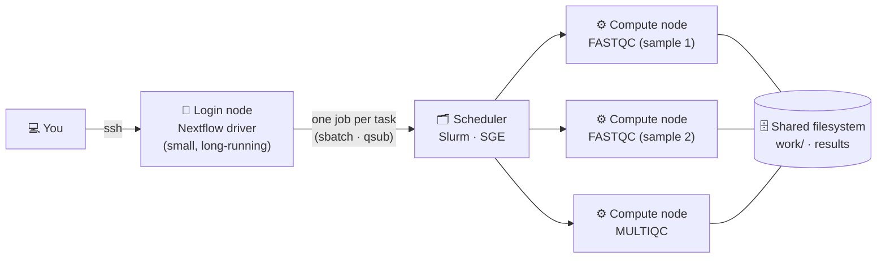

🚀 **Start now:** [](https://codespaces.new/Eco-Flow/training) — *first launch takes a couple of minutes to build.*

---

⏱ **Estimated time:** ~40 minutes &nbsp;•&nbsp; 🟡 Practical · optional

> 🎯 **Who is this for?** Anyone who will run nf-core pipelines on a **High-Performance Computing (HPC) cluster** — or who wants to understand how that works before they get an account on one.
>
> **You don't need a cluster for this lesson.** In Step 1 you'll turn your Codespace into a small working cluster, running the same scheduler software (**Slurm**) that real HPCs use. Every command you type here is one you'd type on a real cluster. Step 6 then covers what changes when you move to your institution's machine.

### What you'll learn

- How a cluster works: login node, scheduler, compute nodes
- How to submit, watch and cancel jobs yourself
- How to get a pipeline, and what decides the resources each step asks for
- How to make Nextflow submit every task to the scheduler for you
- How to keep a long run alive, and resume it after an interruption
- What to change when you move to your own cluster, and the common mistakes

---

## Step 0 — How a cluster works

So far everything has run on one machine. A cluster is **many machines sharing one filesystem**. You log in to a shared **login node**, and a **scheduler** hands out time on the **compute nodes** to everyone's jobs.

Nextflow can talk to the scheduler for you, so you never write submission scripts by hand. The `nextflow run` process you start (the **driver**) does no analysis itself: it sends every task to the scheduler as a **separate job**, then watches them. Remember the parallel tasks from [Part 2](/training/pipelines/)? On a cluster they really can run on different machines at the same time.



| Term | What it means |
| :--- | :--- |
| **Login node** | Where you land after `ssh`. Shared by everyone: fine for editing files and submitting jobs, **not** for running heavy tools. |
| **Compute node** | The machines that do the real work. You only get them by submitting jobs. |
| **Scheduler** | Decides which job runs where, and when. Common ones: **Slurm**, **SGE**, PBS, LSF. |
| **Job** | One piece of work sent to the scheduler, with a request for CPUs, memory and time. |
| **Queue / partition** | A named group of compute nodes with its own limits. SGE calls it a *queue*, Slurm a *partition*. |
| **Driver** | The `nextflow run` process itself. It submits and watches jobs, and must keep running until the pipeline finishes. |

---

## Step 1 — Turn your Codespace into a cluster

Run this from the `eco-flow-training` folder:

```bash
bash hpc/start_slurm.sh
```

<details markdown="1">
<summary>✅ Expected output</summary>

The first time it installs Slurm, which takes about a minute. Then:

```
▶ Your practice Slurm cluster is ready 🎉
PARTITION  AVAIL  TIMELIMIT  NODES  STATE NODELIST
codespace*    up   infinite      1   idle codespaces-abc123
```

That table comes from **`sinfo`**, which lists the machines a scheduler has. Yours has one partition, `codespace`, with one node — your Codespace — currently `idle`.
</details>

You now have a real Slurm installation: the same software that runs on thousands of HPC systems, with the same commands. What it *doesn't* have is other machines, so nothing here runs any faster — but everything you do from now on works identically on a real cluster.

> ⚠️ **If your Codespace restarts**, run `bash hpc/start_slurm.sh` again. It's safe to re-run at any time.

---

## Step 2 — Submit a job yourself

Before letting Nextflow do it, submit one job by hand, so you can see what Nextflow will be doing for you later.

Work is sent to a cluster as a **job script**: a shell script whose header says what it needs.

> ▶️ **Try it — write the script**
>
> Create `hello_job.sh` (`nano hello_job.sh`):
>
> ```bash
> #!/bin/bash
> #SBATCH --job-name=hello
> #SBATCH --partition=codespace     # on a real cluster: one of your cluster's partitions
> #SBATCH --cpus-per-task=1
> #SBATCH --mem=1G
> #SBATCH --time=00:05:00
> #SBATCH --output=hello_%j.log     # %j is replaced by the job number
>
> echo "Running on $(hostname)"
> sleep 30
> echo "Finished"
> ```

> ▶️ **Try it — submit it and watch it**
>
> ```bash
> sbatch hello_job.sh
> squeue
> ```

<details markdown="1">
<summary>✅ Roughly what you'll see</summary>

```
Submitted batch job 1
             JOBID PARTITION     NAME     USER ST       TIME  NODES NODELIST(REASON)
                 1 codespace    hello   vscode  R       0:01      1 codespaces-abc123
```

- The `#SBATCH` lines are the **resource request**: how many CPUs, how much memory, how long, and which partition. The scheduler uses them to decide where and when your job runs.
- `ST` is the job's state: `R` = running, `PD` = pending (waiting for resources).
- After about 30 seconds the job finishes and drops off `squeue`. Its output is in the file named by `--output`: read it with `cat hello_1.log`.
</details>

> ▶️ **Try it — cancel a job**
>
> Submit it again and stop it while it's still running:
>
> ```bash
> sbatch hello_job.sh
> squeue
> scancel <JOBID>      # the number sbatch printed
> squeue
> ```
>
> The job disappears from the queue, and its log stops where you interrupted it.

**Remember this script — Step 4 is the punchline.** You've just written a job script by hand. When you run a pipeline, Nextflow writes one of these *per task* and submits them all for you.

### The commands, on both common schedulers

Your cluster may use **SGE** instead of Slurm. The ideas are identical, the names differ:

| To… | Slurm | SGE |
| :--- | :--- | :--- |
| Submit a job script | `sbatch run.sh` | `qsub run.sh` |
| List your jobs | `squeue -u $USER` | `qstat -u $USER` |
| Cancel a job | `scancel <id>` | `qdel <id>` |
| See the nodes / queues | `sinfo` | `qhost` or `qstat -g c` |
| Why is my job not running? | `scontrol show job <id>` | `qstat -j <id>` |
| Details of a finished job | `sacct -j <id>` | `qacct -j <id>` |

And the job states you'll see most often:

| Meaning | Slurm (`squeue`) | SGE (`qstat`) |
| :--- | :--- | :--- |
| Running | `R` | `r` |
| Waiting for resources | `PD` | `qw` |
| Finishing up | `CG` | `t` |
| Rejected — usually a bad resource request | `F` | `Eqw` |

<details markdown="1">
<summary>🟦 The same job script for SGE</summary>

SGE reads the same kind of header, with `#$` instead of `#SBATCH`:

```bash
#!/bin/bash
#$ -N hello                # job name
#$ -q all.q                # your queue
#$ -l h_rt=00:05:00        # wall time
#$ -l mem=1G               # memory per core (some clusters use h_vmem)
#$ -cwd                    # run in the directory you submitted from
#$ -j y                    # merge errors into the output file
#$ -o hello.log

echo "Running on $(hostname)"
sleep 30
echo "Finished"
```

Submit with `qsub hello_job.sh`, watch with `qstat`, cancel with `qdel <job id>`. Your practice cluster here is Slurm, so you can't run this version — but if your cluster is SGE, this is the file you'd write.
</details>

---

## Step 3 — Get a pipeline, and see what it asks for

There are two ways to get a pipeline. Both work the same here and on a cluster.

We'll use **[nf-core/demo](https://nf-co.re/demo)**: a tiny nf-core pipeline (FastQC → trimming with seqtk → MultiQC) that runs in a couple of minutes.

### Way A — let Nextflow fetch it

> ▶️ **Try it**
>
> ```bash
> nextflow pull nf-core/demo -r 1.2.0
> nextflow list
> nextflow info nf-core/demo
> ```

<details markdown="1">
<summary>✅ Roughly what you'll see</summary>

```
Checking nf-core/demo:1.2.0 ...
 downloaded from https://github.com/nf-core/demo.git - revision: 32893afef8 [1.2.0]
```

`nextflow list` shows every pipeline Nextflow has downloaded for you (`nf-core/rnaseq` too, if you did Part 3), and `nextflow info` shows where it keeps them:

```
 project name: nf-core/demo
 repository  : https://github.com/nf-core/demo
 local path  : /home/vscode/.nextflow/assets/.repos/nf-core/demo
 main script : main.nf
 revisions   :
   ...
```
</details>

This is what `nextflow run nf-core/demo` does automatically the first time: it downloads the pipeline from GitHub into `~/.nextflow/assets/`, and **`-r` picks the release**. To delete a downloaded copy, use `nextflow drop nf-core/demo`.

That copy is Nextflow's to manage — it's filed away under a long path like `~/.nextflow/assets/.repos/nf-core/demo/clones/<commit>/`, which is fine for running but awkward for reading. When you want to *look at* a pipeline's code, clone it instead.

### Way B — clone it yourself

**Do this one too** — the exercise after it reads files from this copy.

> ▶️ **Try it**
>
> ```bash
> mkdir -p ~/nf_practical      # a folder of its own, easy to find and remove later
> cd ~/nf_practical
> git clone https://github.com/nf-core/demo.git
> cd demo
> git checkout 1.2.0
> ls
> ```

<details markdown="1">
<summary>✅ Roughly what you'll see</summary>

```
CHANGELOG.md  CITATIONS.md  CODE_OF_CONDUCT.md  LICENSE  README.md  assets  conf  docs
main.nf  modules  modules.json  nextflow.config  nextflow_schema.json  nf-test.config
ro-crate-metadata.json  subworkflows  tests  tower.yml  workflows
```
</details>

With a clone, you point Nextflow at the **folder** rather than the pipeline name — that's what `nextflow run main.nf` did in [Part 5](/training/nanopore-metabarcoding/). There's nothing to run here: Step 4 uses the copy from Way A.

| | **Way A:** `nextflow run nf-core/demo -r 1.2.0` | **Way B:** `git clone` |
| :--- | :--- | :--- |
| **Best for** | Running a published pipeline as-is | Editing the code, pipelines not on nf-core, development branches |
| **Where it lives** | `~/.nextflow/assets/` (managed for you) | Wherever you cloned it |
| **Pin the version** | `-r 1.2.0` | `git checkout 1.2.0` (`-r` isn't used for a folder) |
| **Update** | `nextflow pull nf-core/demo -r <new version>` | `git pull` for the latest code, or `git checkout <new version>` for a release |

> ⚠️ **Always pin the version** (see [Part 3](/training/nfcore-rnaseq/)). Nextflow itself changes too, and a very old pipeline release may not run on a current Nextflow. If an old release stops with `Config parsing failed`, move `-r` to a newer release.

### Who decides the CPUs and memory?

Every step asks the scheduler for CPUs, memory and time. Those numbers come from the pipeline: each step (a *process*) has a **label**, and `conf/base.config` turns labels into resources.

These files come from the copy you cloned in Way B, so start by moving into it:

> ▶️ **Challenge — what does FastQC ask for?**
>
> ```bash
> cd ~/nf_practical/demo      # the clone from Way B
> grep -n "label" modules/nf-core/fastqc/main.nf
> grep -n -A4 "withLabel:process_low" conf/base.config
> ```
>
> (`No such file or directory`? You're not in the clone — go back and do Way B first.)
>
> 1. How many CPUs, how much memory and how much time does the FASTQC step ask for?
> 2. The numbers are multiplied by `task.attempt`, which is `1` on the first try and `2` on a retry. What does FASTQC ask for on its second try?

<details markdown="1">
<summary>✅ Answer</summary>

```
3:    label 'process_low'
```
```
    withLabel:process_low {
        cpus   = { 2     * task.attempt }
        memory = { 12.GB * task.attempt }
        time   = { 4.h   * task.attempt }
    }
```

1. **2 CPUs, 12 GB, 4 hours.**
2. **4 CPUs, 24 GB, 8 hours.** Near the top of `conf/base.config`, the `errorStrategy` line says to **retry** a task that failed with an exit code between 130 and 145 — codes that usually mean the scheduler killed the job for using too much memory or time. So nf-core pipelines automatically try again with double the resources.
</details>

On a cluster these numbers become the job's request: a job asking for 12 GB waits until a node with 12 GB free is available. You'll see the request Nextflow actually sends in the next step.

<details markdown="1">
<summary>🔍 Optional — a tour of the pipeline folder</summary>

| Path | What's in it |
| :--- | :--- |
| `main.nf` | The entry point: what `nextflow run` starts |
| `workflows/` | The main workflow: which steps run, in what order |
| `subworkflows/`, `modules/` | The building blocks. `modules/nf-core/` are shared with other nf-core pipelines, `modules/local/` are specific to this one |
| `conf/base.config` | Resources for each label (what you just looked at) |
| `conf/test.config` | The `test` profile: tiny example input and small resource caps |
| `nextflow.config` | Default parameters, and the **profiles** (`docker`, `singularity`, `test`, institutional configs…) |
| `nextflow_schema.json` | Every `--parameter`, with its description and allowed values |

`nextflow config` prints the configuration after all profiles and config files are merged. Compare these two and look at the `docker {` and `singularity {` blocks — switching the profile just flips which container engine is `enabled`:

```bash
nextflow config ~/nf_practical/demo -profile test,docker
nextflow config ~/nf_practical/demo -profile test,singularity
```
</details>

Keep the clone — you'll run it in the next step. For now, go back to the course folder, so the run's working files land there:

```bash
cd /workspaces/training/eco-flow-training
```

---

## Step 4 — Let Nextflow submit the jobs

This is the whole point of the lesson. One small config file makes Nextflow write the `#SBATCH` header you wrote in Step 2 — for every task in a pipeline:

```bash
cat hpc/slurm_codespaces.config
```

```groovy
process {
    executor = 'slurm'
    queue    = 'codespace'    // the Slurm partition start_slurm.sh creates
}
```

`executor = 'slurm'` is the whole trick; `queue` says which partition to use.

Now run the pipeline with it — the same copy you cloned and read in Step 3, so you know exactly what's about to run. The `test` profile supplies tiny example data, so you need no inputs of your own:

```bash
nextflow run ~/nf_practical/demo -profile test,docker -c hpc/slurm_codespaces.config --outdir demo_results
```

(No `-r` here: the clone is already fixed at release 1.2.0 by the `git checkout` you did. Running the downloaded copy instead — `nextflow run nf-core/demo -r 1.2.0 …` — does exactly the same thing.)

While it runs, open a **second terminal** (the ➕ in the terminal panel) and watch jobs come and go:

```bash
watch -n 2 squeue      # Ctrl+C to stop watching
```

> ✅ **What to look for:** the line **`executor >  slurm`**. That means every task is going to the scheduler as its own job. The run takes a few minutes (longer the first time, while containers download) and ends like this:
>
> ```
> executor >  slurm (8)
> [f4/044c12] NFCORE_DEMO:DEMO:COWPY                   | 1 of 1 ✔
> [94/ace98a] NFCORE_DEMO:DEMO:FASTQC (SAMPLE2_PE)     | 3 of 3 ✔
> [68/46c1d9] NFCORE_DEMO:DEMO:SEQTK_TRIM (SAMPLE1_PE) | 3 of 3 ✔
> [be/7be914] NFCORE_DEMO:DEMO:MULTIQC (demo)          | 1 of 1 ✔
> -[nf-core/demo] Pipeline completed successfully-
> ```
>
> If it says **`executor >  local`**, the config wasn't picked up and the tasks ran outside the scheduler. Check the `-c hpc/slurm_codespaces.config` path.

> ▶️ **Challenge — what did Nextflow ask Slurm for?**
>
> Nextflow writes a job script for every task: the `.command.run` file you met in [Part 3](/training/nfcore-rnaseq/). Take the hash from a **FASTQC** line of *your* output and look at the top of its script:
>
> ```bash
> grep "^#SBATCH" work/94/ace98a*/.command.run     # use your own FASTQC hash
> ```
>
> In Step 3 you found FASTQC wants 2 CPUs, 12 GB and 4 hours. Does the job ask for that? If not, why not?

<details markdown="1">
<summary>✅ Answer</summary>

```
#SBATCH -J nf-NFCORE_DEMO_DEMO_FASTQC_(SAMPLE2_PE)
#SBATCH -o /workspaces/training/eco-flow-training/work/94/ace98a.../.command.log
#SBATCH --no-requeue
#SBATCH --signal B:USR2@30
#SBATCH -c 2
#SBATCH -t 01:00:00
#SBATCH --mem 4096M
#SBATCH -p codespace
```

It asks for **2 CPUs (`-c 2`)**, but only **4 GB** and **1 hour**. The `test` profile caps every step at 2 CPUs, 4 GB and 1 hour (a `resourceLimits` block in `conf/test.config`) so the test runs anywhere. In a real run the same job would ask for the full 12 GB and 4 hours. `-p codespace` comes from the `queue` line in our config.

It's the same kind of file you wrote in Step 2 — you just didn't have to write it. On an SGE cluster, the same task's script would start with `#$ -N …` and `#$ -l h_rt=…` instead.
</details>

<details markdown="1">
<summary>🟦 The same config for an SGE cluster</summary>

```groovy
process {
    executor = 'sge'
    queue    = 'all.q'        // your queue
    penv     = 'smp'          // the parallel environment name — ask your HPC team
}
```

You rarely write this yourself: if your cluster is listed on [nf-co.re/configs](https://nf-co.re/configs), its profile already contains it (Step 6). Writing one from scratch is the ★ [advanced page](/training/hpc-config/).
</details>

---

## Step 5 — Keep the run alive

A real analysis runs for hours or days, and **the driver has to keep running the whole time**. If you close your laptop or lose your connection, `nextflow run` stops, and the pipeline stops with it.

The usual answer is to submit the driver *itself* as a small job. That's what `hpc/run_demo_slurm.sh` does:

```bash
cat hpc/run_demo_slurm.sh
sbatch hpc/run_demo_slurm.sh
watch -n 2 squeue
```

<details markdown="1">
<summary>✅ Roughly what you'll see</summary>

```
             JOBID PARTITION     NAME     USER ST       TIME  NODES NODELIST(REASON)
                12 codespace nf-NFCOR   vscode  R       0:07      1 codespaces-abc123
                13 codespace nf-NFCOR   vscode  R       0:07      1 codespaces-abc123
                11 codespace nf_drive   vscode  R       0:24      1 codespaces-abc123
```

Job 11 is the **driver** (`nf_driver`), and it has submitted pipeline steps (`nf-NFCOR…`) as jobs of their own. Its `#SBATCH` header asks for just 1 CPU and 2 GB, because Nextflow itself is light — the real work happens in the jobs it submits.

Follow its output with `tail -f nf_driver_<JOBID>.log`.
</details>

> ▶️ **Try it — stop a run, then resume it**
>
> 1. While pipeline jobs are running, cancel the **driver**: `scancel <driver JOBID>`. Check `squeue`: its pipeline jobs go too, because Nextflow cancels its own jobs when it stops.
> 2. Submit it again: `sbatch hpc/run_demo_slurm.sh` (the script already includes `-resume`).
> 3. When it finishes, find the steps that were reused: `grep -i cached nf_driver_<new JOBID>.log`

Notice the script runs `nf-core/demo -r 1.2.0` rather than your clone: a job script should stand on its own, so it names the pipeline and its version instead of depending on a folder that might move. That's how you'd write it on a real cluster too.

One line in that script is worth a look: **`-w work_slurm`**. `-w` chooses where Nextflow keeps its working files. Here it gives this run a folder of its own, so it doesn't simply reuse everything Step 4 already finished. On a cluster you use the same flag for a different reason: those files get very large, so you point `-w` at wherever your cluster wants big data to live.

---

## Step 6 — Taking this to your own cluster

Everything so far works the same on a real HPC. These are the differences.

### 1. Getting on, and checking what's there

```bash
ssh your_username@your.cluster.ac.uk   # log in to the login node
module avail nextflow                  # is Nextflow provided as a module?
module load nextflow                   # load it (names vary between clusters)
nextflow -version
java -version                          # Nextflow needs Java 17 or newer
singularity --version || apptainer --version
```

- **No Nextflow module?** You can usually install it in your home directory: see the [official install guide](https://docs.seqera.io/nextflow/install).
- **Singularity, not Docker.** Docker needs a background service running with root privileges, which shared clusters can't hand out. So where this lesson used `-profile docker`, you'll use `-profile singularity` (or `apptainer`). Both run the same containers.

### 2. Is there already a config for your cluster?

This is the most useful thing to check. The nf-core community keeps ready-made configs for around 160 institutions at **[nf-co.re/configs](https://nf-co.re/configs)**, each describing that cluster's scheduler, container engine and limits — so you don't have to write the `executor`/`queue` config from Step 4 yourself. The page lists them by name: `cambridge`, `crick`, `eddie`, `imperial`, `sanger`, `ucl_myriad` and many more.

<!-- TODO: add a screenshot of the nf-co.re/configs profile list here -->

If yours is listed, add it as a profile and Nextflow knows how to talk to your cluster:

```bash
nextflow run nf-core/demo -r 1.2.0 -profile test,<your_cluster> --outdir demo_results
```

That's the `-profile ucl_myriad` you saw in [Part 5](/training/nanopore-metabarcoding/). **Open your cluster's page first** — most list setup steps, such as which Java module to load.

**Not listed?** In order:

1. **Ask around your institution.** Someone in a neighbouring group often has a working config already.
2. **Ask your HPC team.** They may not know Nextflow, but they can tell you the scheduler, queue names and limits, which is most of what a config needs.
3. **Ask the community.** The [nf-core Slack](https://nf-co.re/join/slack) is friendly, and you can open an issue on [nf-core/configs](https://github.com/nf-core/configs/issues) describing your cluster.
4. **Ask us.** Email Eco-Flow at **ecoflow . ucl @ gmail . com** and we'll help you put one together.

Writing one yourself is covered in ★ [Advanced: setting up Nextflow for your HPC](/training/hpc-config/).

### 3. Where your files should be

| What | Default | Where it should go | How |
| :--- | :--- | :--- | :--- |
| **Work directory**: every intermediate file, can be huge | `./work` | Wherever your cluster keeps large working data | `-w /path/with/space/work` |
| **Results** | `--outdir` | Storage you can keep, ideally backed up | `--outdir /path/to/results` |
| **Nextflow's own files**: downloaded pipelines, plugins | `~/.nextflow` | Home is usually fine (it's small) | nothing to do |

> ⚠️ **Ask where large data should live — don't assume.** Many clusters have a "scratch" area for this, but not all, and the rules differ: some aren't backed up, some delete files you haven't touched for a few weeks. Your HPC team, or your cluster's page on nf-co.re/configs, will tell you. Two things to remember once you know: copy results somewhere safe, and if `work/` is deleted, `-resume` has nothing left to resume from.

### 4. Keeping the driver alive

Step 5's approach — submitting the driver as a job — is the best option for long runs, and works on any cluster. Some clusters don't allow long-running processes on the login node at all, so check the local rules.

<details markdown="1">
<summary>🟨 Slurm — <code>run.sh</code>, submit with <code>sbatch run.sh</code></summary>

```bash
#!/bin/bash
#SBATCH --job-name=nf_driver
#SBATCH --partition=<your_partition>
#SBATCH --cpus-per-task=1
#SBATCH --mem=4G
#SBATCH --time=48:00:00
#SBATCH --output=nf_driver_%j.log

module load nextflow                  # if your cluster uses modules

nextflow run nf-core/demo -r 1.2.0 \
  -profile singularity,<your_cluster> \
  --outdir /path/to/results \
  -w /path/with/space/work \
  -ansi-log false \
  -resume
```
</details>

<details markdown="1">
<summary>🟦 SGE — <code>run.sh</code>, submit with <code>qsub run.sh</code></summary>

```bash
#!/bin/bash -l
#$ -N nf_driver
#$ -l h_rt=48:00:00
#$ -l mem=4G                          # some SGE clusters use h_vmem instead
#$ -cwd
#$ -o nf_driver.log
#$ -j y

module load nextflow                  # if your cluster uses modules

nextflow run nf-core/demo -r 1.2.0 \
  -profile singularity,<your_cluster> \
  --outdir /path/to/results \
  -w /path/with/space/work \
  -ansi-log false \
  -resume
```
</details>

Two alternatives, useful for shorter runs:

- **`tmux` or `screen`** — start a session on the login node, run Nextflow inside it, then detach with `Ctrl+b` then `d`. It keeps running after you log out; reattach with `tmux attach -t myrun`.
- **`-bg`** — Nextflow's own background flag, which writes progress to `.nextflow.log` (follow it with `tail -f .nextflow.log`). On its own it may not survive logging out, so wrap it: `nohup nextflow run … -bg > nextflow.out 2>&1`.

<details markdown="1">
<summary>🧬 Optional — rerun Part 3's RNA-Seq analysis on your cluster</summary>

The Part 3 data is in this repository, so you can repeat that analysis on a real cluster:

```bash
git clone https://github.com/Eco-Flow/training.git
cd training/eco-flow-training

# The samplesheet from Part 3, with paths for wherever you cloned it
cat > samplesheet.csv <<EOF
sample,fastq_1,fastq_2,strandedness
CONTROL_REP1,$PWD/data/SRR6357070_1.fastq.gz,$PWD/data/SRR6357070_2.fastq.gz,auto
CONTROL_REP2,$PWD/data/SRR6357071_1.fastq.gz,$PWD/data/SRR6357071_2.fastq.gz,auto
CONTROL_REP3,$PWD/data/SRR6357072_1.fastq.gz,$PWD/data/SRR6357072_2.fastq.gz,auto
MANIPULATED_REP1,$PWD/data/SRR6357073_1.fastq.gz,,auto
MANIPULATED_REP2,$PWD/data/SRR6357074_1.fastq.gz,,auto
MANIPULATED_REP3,$PWD/data/SRR6357075_1.fastq.gz,,auto
EOF

# The genome and annotation, as in Part 3 Step 4
wget -O genome.fasta https://raw.githubusercontent.com/nf-core/test-datasets/7f1614baeb0ddf66e60be78c3d9fa55440465ac8/reference/genome.fasta
wget -O genes.gff.gz https://raw.githubusercontent.com/nf-core/test-datasets/7f1614baeb0ddf66e60be78c3d9fa55440465ac8/reference/genes.gff.gz
```

Then use this as the `nextflow run` line in the driver script above:

```bash
nextflow run nf-core/rnaseq -r 3.26.0 \
  -profile singularity,<your_cluster> \
  --input $PWD/samplesheet.csv \
  --fasta $PWD/genome.fasta \
  --gff $PWD/genes.gff.gz \
  --outdir rnaseq_results \
  -resume
```

nf-core/rnaseq 3.26.0 needs **Nextflow 25.04.3 or newer** (`nextflow -version`).
</details>

### 5. What the practice cluster couldn't show you

- **Queues and limits.** Real clusters have several partitions/queues with maximum times and sizes, and jobs asking for more are rejected. Your HPC team's documentation lists them.
- **Waiting.** On a busy cluster, jobs sit in `PD`/`qw` for a while before they start. That's normal.
- **Real parallelism.** Here everything shared one machine; there, tasks run on many machines at once.
- **Internet access.** Compute nodes often have none. Pull pipelines and containers on the login node first: `nextflow pull`, or [`nf-core pipelines download`](https://nf-co.re/docs/nf-core-tools/pipelines/download) for the containers too.

---

## Step 7 — Common issues list

| ✅ Do | Why |
| :--- | :--- |
| **Run the `test` profile first** | It catches config mistakes in minutes, not hours |
| **Check for `executor > slurm`/`sge`**, not `local` | `local` means everything is running on the login node |
| **Keep the driver alive** (Step 5), and don't run heavy tools yourself on the login node | It's shared, and admins will stop long or heavy processes there |
| **Pin the version with `-r`** | You get the same version of the pipeline every time, so a rerun months later gives the same analysis |
| **Use Singularity/Apptainer**, not Docker | Docker is almost never allowed on shared clusters |
| **Put `work/` wherever your cluster keeps large data, and results somewhere you can keep** | `work/` gets very large, and temporary areas are often cleaned out automatically |
| **Pre-download if compute nodes are offline** | Use `nextflow pull` or `nf-core pipelines download` on the login node |
| **Add `-resume` after fixing a problem** | Finished steps are reused instead of recomputed |
| **Read `<outdir>/pipeline_info/`** | nf-core writes an execution report, timeline and trace there, showing how much memory and time each step *really* used |
| **Keep your run command in a script** (like `run.sh`) and in git | Reproducible, easy to rerun, easy to share (see [Part 6](/training/github-basics/)) |
| **Clean up when you're happy** | `nextflow clean -f`, or delete `work/`, but only once you won't need `-resume` |

> 🔍 **Exit codes 130–145** (for example `137` or `140`) usually mean the **scheduler killed the job** for going over its memory or time. nf-core pipelines retry once with double the resources (Step 3). If a step fails again, it needs more than it's allowed: ask your HPC team, or see how to raise a label's resources on the ★ [advanced page](/training/hpc-config/).

---

## Recap

- A cluster is a **login node** plus a **scheduler** handing out **compute nodes**. You send it **jobs**.
- A job is a script with a **resource request** in its header (`#SBATCH`, or `#$` on SGE). You wrote one in Step 2.
- Nextflow writes those scripts for you: **`executor = 'slurm'`** (or `'sge'`) is all it takes, and each step's CPUs and memory come from its **label** in `conf/base.config`.
- **Smoke-test** with the `test` profile and check the banner says `executor > slurm`, not `local`.
- Keep the **driver** alive as its own job, and use **`-resume`** after any interruption.
- On your own cluster: load Nextflow, use **Singularity**, and check [nf-co.re/configs](https://nf-co.re/configs) for a ready-made profile before writing anything yourself.

---

## Finish

🎉 **You've run a pipeline through a real job scheduler**, and seen how Nextflow turns each step into a job — exactly as it will on your institution's cluster.

> 🧹 **Tidying up.** The practice clone from Step 3 is no longer needed once you've finished the lesson. **Check the path before pressing enter** — `rm -rf` deletes without asking:
>
> ```bash
> rm -rf ~/nf_practical
> ```

**Next steps:**

- Continue to **[Part 8 · Seqera Platform ▶️](/training/seqera-platform/)** to watch your runs live in the browser.
- Your cluster has no ready-made config? See ★ **[Advanced: setting up Nextflow for your HPC](/training/hpc-config/)**.
- Stuck? The [nf-core Slack](https://nf-co.re/join/slack) is full of people running pipelines on clusters like yours. Or get in touch with us at Eco-Flow: **ecoflow . ucl @ gmail . com**
