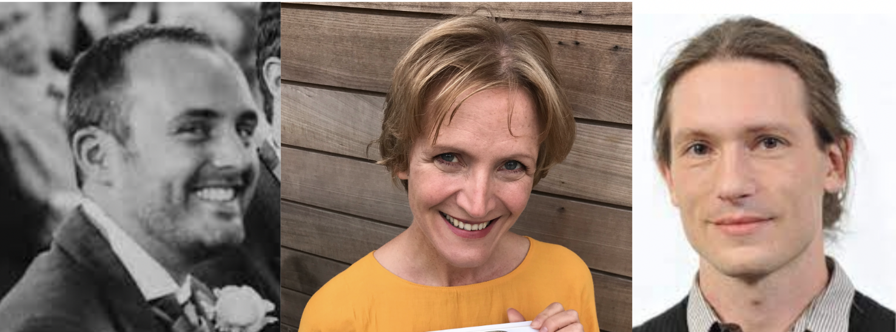
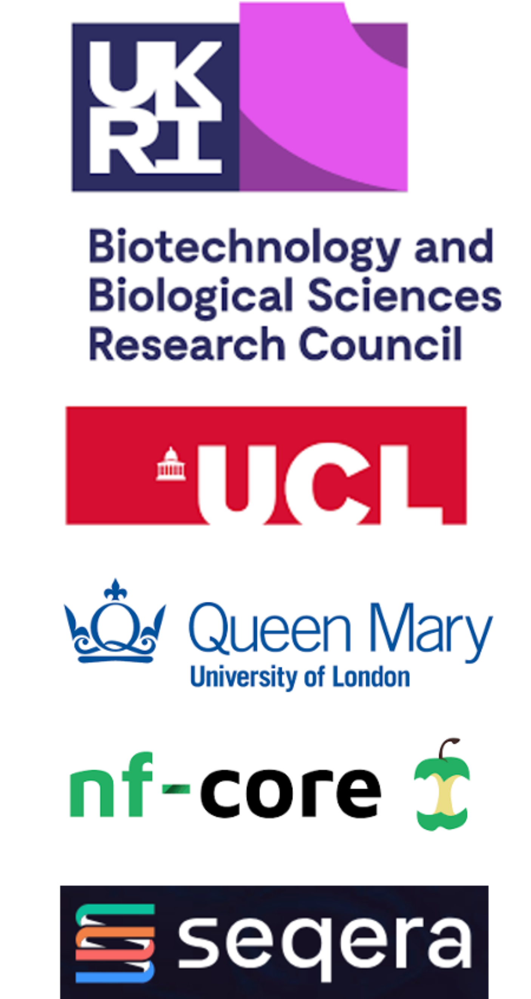

# About us

We are a team of four researchers and bioinformatians comprised of:

Ecology Supervisor             : Seirian Sumner

Informatics/Ecology Supervisor : Yannick Wurm

Co-investigator lead           : Chris Wyatt

Research lead                  : To be announced

# Involved organisations

# BBSRC

BBSRC funded this initiative 
See our grant [here](https://shorturl.at/bjAI3) 
Which was part of the Bioinformatics and Biological Resources Fund 

# UCL

UCL (University College London) is the host university of Sumner, Wyatt and our technical lead

# Queen Mary

Queen Mary university is the host univeristy of Yannick Wurm

# nf-core

Nf-core is an organisation that sets the standards of bioinformatics workflows using Nextflow and is central to the philosophy of our initiative.

# Seqera Labs

Seqera sponsored this initiative and provide technical support 

 

# Contact

To learn more about this initiative or enquire about a collaboration contact Chris Wyatt
-> c . wyatt AT ucl . ac .  uk

