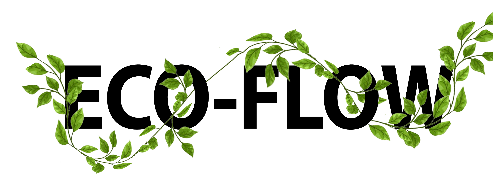

# About us

  

The Eco-flow team is comprised of four core researchers/bioinformatians:
  

# Project lead           : Chris Wyatt
Chris is a senior bioinformatician on the project, with a background in omic technologies and pipeline development.
  

# Technical lead                  : Simon Murray
Simon is a senior bioinformatician on the project, with a background in pipeline development and containerisation.
  

# Ecology Advisor             : Seirian Sumner
Professor Seirian Sumner is a leading researcher in ecology and genomics.
  

# Bioinformatics Advisor : Yannick Wurm
Professor Yannick Wurm is a data scientist expert on genome analysis and evolution.
    

  

# Funding

## BBSRC

BBSRC funded this initiative 
See our grant [here](https://shorturl.at/bjAI3) 
This is part of the Bioinformatics and Biological Resources Fund

  

## Seqera Labs

Seqera sponsors this initiative and provides technical support 

# Host universities

## UCL

UCL (University College London) is the host university of Sumner, Wyatt and our technical lead
  

## Queen Mary

Queen Mary university is the host university of Yannick Wurm

  
# Associated organisations

# nf-core

Nf-core is an organisation that sets the standards of bioinformatics workflows using Nextflow and is central to the philosophy of our initiative.

   

# Contact

To learn more about this initiative or enquire about a collaboration contact Chris Wyatt
-> c . wyatt AT ucl . ac .  uk

Or Simon Murray
-> simon . murray AT ucl . ac .  uk

Or 
-> ecoflow . ucl AT gmail . com
